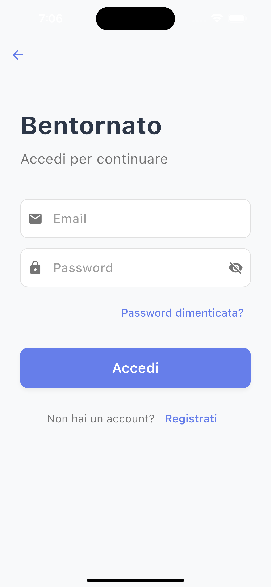
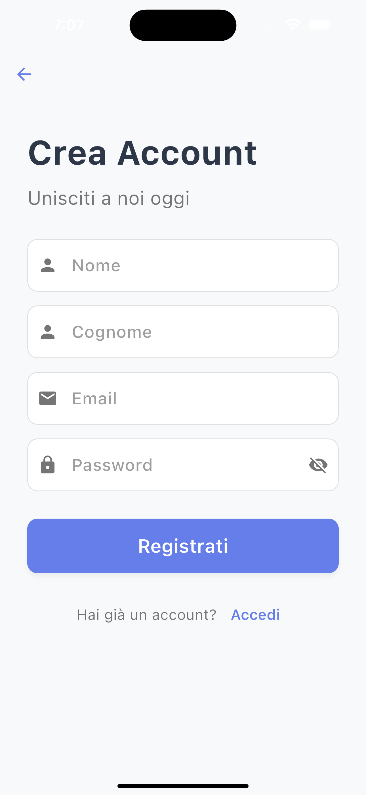
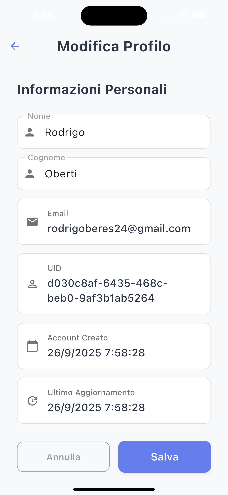

# 🚀 ERSAF Sample App

Una applicazione Flutter completa per la gestione degli utenti con operazioni CRUD (Create, Read, Update, Delete). I dati degli utenti sono salvati localmente in un file JSON e l'utilizzo di una API golang che fa vedere una lista di viaggi Bus e companies (nei dettagli del viaggio). sviluppata con architettura clean e state management BLoC

## 📋 Requisiti del Progetto

### Requisiti Essenziali
- ✅ **Implementazione delle operazioni CRUD sugli utenti** (Create, Read, Update, Delete)
- ✅ **Salvataggio dati utenti in file JSON** (storage locale sicuro)
- ✅ **Utilizzo di almeno una API esterna** (integrazione con API BUS)
- ✅ **Sviluppo esclusivo in Flutter** (framework moderno per mobile)

### Note Aggiuntive
Oltre ai requisiti essenziali, l'applicazione include funzionalità aggiuntive come:
- 🔐 **Pagina di login** con autenticazione sicura
- 🔍 **Filtri di ricerca** per città di partenza o arrivo
- 📱 **Supporto iOS e Android** con Material Design 3

## ✨ Caratteristiche Principali

### 👥 Gestione Utenti
- Registrazione e login sicuro
- Profilo utente personalizzabile
- Gestione completa CRUD con validazione
- Persistenza dati JSON locale

### 🚌 Sistema Trasporti
- Visualizzazione percorsi/viaggi disponibili
- Integrazione API esterna per dati real-time
- Ricerca e filtri avanzati
- Interfaccia intuitiva per prenotazioni

### 🔧 Backend API

L'applicazione si integra con un backend REST API sviluppato in **Go/Golang** con:
- **Framework**: Gin web framework
- **Database**: PostgreSQL con Supabase
- **Documentazione**: Swagger/OpenAPI
- **Autenticazione**: JWT tokens (Not Implemented in this sample app)
- **Deployment**: Render.com

**Repository Backend**: [Link al repository Go backend](https://github.com/Rodrigoberes/TransportBookingBackend.git)

### 🏗️ Architettura Tecnica
- **State Management**: BLoC Pattern
- **Architettura**: Clean Architecture (Business/Presentation)
- **Storage**: File JSON locali
- **API**: Integrazione REST con Dio
- **UI**: Material Design 3 + Cupertino widgets

## 📁 Struttura del Progetto

```
lib/
├── main.dart                     # Entry point applicazione
├── business/                     # Logica di business
│   ├── blocs/                    # State management BLoC
│   │   ├── user/                 # Gestione stato utente
│   │   └── route/                # Gestione percorsi
│   ├── models/                   # Modelli dati
│   │   ├── user.dart             # Modello utente
│   │   ├── company.dart          # Modello compagnia
│   │   └── route.dart            # Modello percorso
│   ├── repositories/             # Data access layer
│   └── di/                       # Dependency injection
├── presentation/                 # Layer presentazione
│   │└── screens/                  # Schermate UI
│   │   ├── login_screen.dart     # Login
│   │   ├── signup_screen.dart    # Registrazione
│   │   ├── home_screen.dart      # Dashboard principale
│   │   ├── profile_screen.dart   # Profilo utente
│   │   └── transports_screen.dart # Elenco trasporti
│   └── widgets/                   # Componenti riutilizzabili
├── routes/                       # Gestione navigazione
├── services/                     # Servizi esterni
│   ├── api_service.dart          # Chiamate API
│   └── local_storage_service.dart # Storage JSON 
│   └── assets_service.dart       # API Config             
```

## 🎯 Roadmap

### ✅ Completato (95%)
- **CRUD Utenti**: Operazioni complete create/read/update/delete
- **Storage JSON**: Persistenza dati locali sicura
- **API Esterna**: Integrazione trasporti funzionante
- **Autenticazione**: Sistema login/registrazione
- **Testing**: Unit tests per modelli e repository

### 🔄 In Sviluppo
- **API**: Integrazione completa booking/prenotazione

### 📋 Pianificato
- **Testing Completo**: Coverage 100% con integration tests
- **Performance**: Ottimizzazioni e caching
- **Sicurezza**: Crittografia dati sensibili
- **Sentry**: Tracciare, gestire e correggere gli errori nelle applicazioni con Sentry

## 🚀 Come Iniziare

### Prerequisiti
- Flutter 3.35.4
- Dart 3.9.2
- VS Code
- Dispositivo/emulatore iOS/Android

### Installazione

1. **Clona il repository**
   ```bash
   git clone https://github.com/Rodrigoberes/ERSAF-Sample-App.git
   ```

2. **Installa dipendenze**
   ```bash
   flutter pub get
   ```

3. **Genera classi (se necessario)**
   ```bash
   flutter pub run build_runner build --delete-conflicting-outputs
   ```

4. **Avvia l'applicazione**
   ```bash
   flutter run
   ```

### Testing e Qualità Codice

```bash
# Formattazione codice
dart fix --apply

# Analisi statica
flutter analyze

# Esecuzione tests
flutter test
```

## 📱 Preview Applicazione

### 📁 Struttura Assets Media
Per aggiungere screenshot e GIF al README, organizza i file nella seguente struttura:

```
docs/
├── screenshots/          # Screenshot delle schermate
│   ├── login_screen.png
│   ├── signup_screen.png
│   ├── home_screen.png
│   ├── transports_screen.png
│   ├── profile_screen.png
│   └── edit_profile_screen.png
```

### Video Demo
[](https://youtu.be/YOUR_VIDEO_ID)
*Video dimostrativo completo delle funzionalità dell'app*

### Screenshots
<div align="center">

| Schermata Login | Schermata Registrazione | Dashboard Home |
|:---------------:|:-----------------------:|:--------------:|
|  |  |  |

| Schermata Trasporti | Schermata Profilo | Schermata Modifica |
|:-------------------:|:-----------------:|:------------------:|
|  |  |  |

</div>

### GIF Animazioni
<div align="center">

#### Navigazione App

*Navigazione tra le schermate principali*

#### Ricerca Trasporti

*Ricerca e filtraggio dei trasporti disponibili*

#### Gestione Utente

*Registrazione, login e modifica profilo*

</div>

## 🛠️ Tecnologie Utilizzate

- **Framework**: Flutter
- **Linguaggio**: Dart
- **State Management**: BLoC
- **Networking**: Dio HTTP Client
- **Storage**: File system JSON
- **Architecture**: Clean Architecture
- **Dependency Injection**: GetIt
- **Serialization**: Freezed + JSON Serializable
- **Testing**: Flutter Test + Mockito

---

*Ultimo aggiornamento: 2025-09-26*
*Completion Rate: 95%*